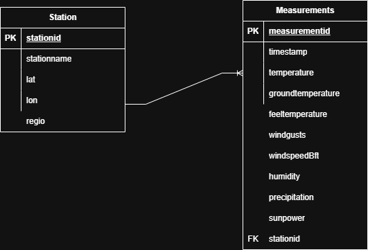

# Dutch Weather Analysis — Zypp Skill‑Test

A reproducible mini‑pipeline that ingests live **Buienradar** weather‑station data, persists one day’s worth of measurements in **SQLite**, answers analytical questions, and demonstrates basic automation strategies.

---

## Highlights

| Part                   | What you get                                                                                   | Key files                                        |
|------------------------|------------------------------------------------------------------------------------------------|--------------------------------------------------|
| **1 Data Integration** | ETL script -> tidy CSVs -> relational SQLite with PK/FK & indexes                              | `measurement.extractor.py`, `weather_data_db.py` |
| **2 Data Analysis**    | SQL queries that answer Q5–Q8 via CLI                                                          | `weather_analysis.py`                            |
| **3 Automation**       | Two options:<br>▪️ OS cron wrapper (`etl.py`)<br> Pure‑Python APScheduler (`etl_scheduler.py`) | ─                                                |
| **ER‑Diagram**         | Simple one‑to‑many schema, screenshot in `figures/erd.png`                                     | —                                                |

---

## Quick start

```bash
# 1 Clone
$ git clone https://github.com/Rajivrocks-Ltd/skilltest-buienradar.git

# 2 Install deps (Python ≥3.10)
$ python -m venv .venv && source .venv/bin/activate
$ pip install -r requirements.txt

# 3 One‑off ETL (≈1s)
$ python measurement_extractor.py           # writes data/measurements.csv + data/stations.csv
$ python weather_data_db.py               # → data/weather.sqlite

# 4 Answer Part‑2 questions
$ python weather_analysis.py               # prints Q5–Q8 results
```

> **Low‑vision tip:** redirect outputs to a file (`… > answers.txt`) and open in your preferred editor/zoom.

---

## 📁 Project layout

```
├─ data/                 # CSVs & SQLite live here (git‑ignored)
│  ├─ measurements.csv
│  ├─ stations.csv
│  └─ weather.sqlite
├─ logs/                 # Rolling ETL logs
├─ figures/
│  └─ erd.png            # ERD‑diagram png
├─ measurement_extractor.py
├─ weather_data_db.py
├─ weather_analysis.py
├─ etl.py
├─ etl_scheduler.py
├─ requirements.txt
└─ README.md
```

---

## How it works

1. **`measurement_extractor.py`**

    * Fetches `https://data.buienradar.nl/2.0/feed/json` (updated \~10 min).
    * Creates **two** CSVs:

        * `measurements.csv` — adds `measurementid` (UUID PK).
        * `stations.csv` — unique list of stations.
2. **`build_weather_db.py`**

    * Ensures schema: `stations` (PK`stationid`),
      `measurements` (PK`measurementid`, FK`stationid`).
    * `INSERT OR IGNORE / OR REPLACE` keeps runs clean
3. **`weather_analysis.py`** — pure SQL answers for:

    * Highest temperature (Q5)
    * Average temperature (Q6)
    * Biggest feel‑temp gap (Q7)
    * Station in the North Sea (Q8)
4. **Automation choices**

    * **OS cron:** schedule `etl.py` every 20min.
    * **APScheduler:** `python etl_scheduler.py` (blocking) *or*
      call `register_cron_jobs(job_func)`

---


## ER‑diagram



*One station → many measurements (crow’s‑foot on the measurements side).*  Foreign‑key enforcement is enabled (`PRAGMA foreign_keys=ON`).

---

## Testing / Validation

```bash
$ sqlite3 data/weather.sqlite "PRAGMA integrity_check;"            # expect: ok
$ sqlite3 data/weather.sqlite "SELECT COUNT(*) FROM measurements;"  # growing count after each run
```

---
